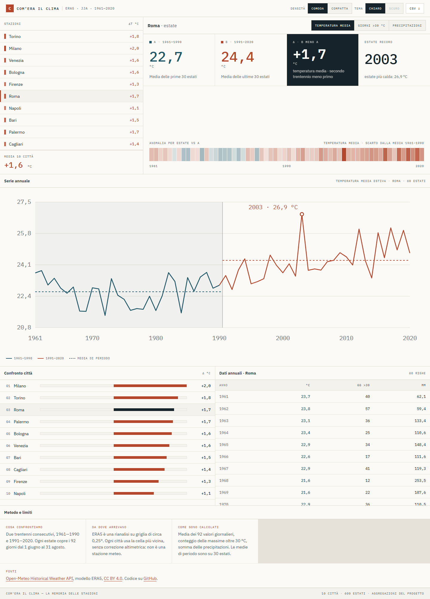

# Com’era il clima

**La memoria delle stagioni** è una piccola applicazione statica in italiano per confrontare le estati 1961–1990 e 1991–2020 in dieci città italiane.

Mostra tre indicatori ricavati da ERA5: temperatura media estiva, giorni con massima strettamente superiore a 30 °C e precipitazioni totali. Tutti i dati sono aggregati in fase di preparazione: il browser non contatta l’API climatica.



## Stato

L’applicazione è pubblicata su **<https://giubud.github.io/comera-il-clima/>**.

Repository: <https://github.com/giubud/comera-il-clima>.

Versione logica dei dati: `f7a18f7fd9b26685` (manifest rigenerato il 18 settembre 2026).

## Avvio locale

Richiede Node.js 22.

```bash
npm ci
npm run dev
```

Il percorso locale è `http://localhost:5173/comera-il-clima/`.

## Comandi

```bash
npm run typecheck
npm test
npm run data:validate
npm run build
npm run test:e2e
```

La pipeline dati è manuale e separata dalla build ordinaria:

```bash
npm run data:fetch -- --city roma --from 1961 --to 1961
npm run data:fetch -- --all
npm run data:build
npm run data:validate
```

La cache grezza viene salvata in `.cache/open-meteo/` e non entra nel repository. Non eseguire `data:build` senza una cache completa e validata.

## Metodologia e provenienza

- [Metodologia](docs/METHODOLOGY.md)
- [Fonti e provenienza](docs/DATA_SOURCES.md)
- [Licenza dei dati](DATA_LICENSE.md)
- [Verifica pilota della fonte](docs/DATA_CHECK.md)
- [Piano operativo](docs/PLAN.md)

## Contribuire

Le istruzioni per aggiungere una città, rigenerare i dati ed eseguire le verifiche sono in [CONTRIBUTING.md](CONTRIBUTING.md).

Il codice è distribuito con licenza MIT. I dati hanno licenze e attribuzioni separate descritte in [DATA_LICENSE.md](DATA_LICENSE.md).
