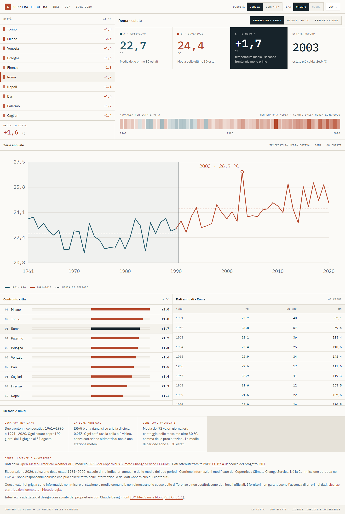

# Com’era il clima

**La memoria delle stagioni** è un'applicazione statica in italiano per confrontare le estati di dieci città italiane tra il 1961 e il 2020. Il confronto iniziale usa 1961–1990 e 1991–2020; entrambi i periodi sono modificabili.

Mostra tre indicatori ricavati da ERA5: temperatura media estiva, giorni con massima strettamente superiore a 30 °C e precipitazioni totali. Tutti i dati sono aggregati in fase di preparazione: il browser non contatta l’API climatica.

La console include mappa locale, serie annuale e media mobile, strisce di anomalia, confronto tra città, anno selezionabile e tabella di 60 estati. Città, indicatore, periodi e vista selezionata sono condivisibili tramite URL; tema e ordinamento sono preferenze locali.



## Stato

L’applicazione è pubblicata su **<https://giubud.github.io/comera-il-clima/>**.

Repository: <https://github.com/giubud/comera-il-clima>.

Versione logica dei dati: `f7a18f7fd9b26685` (manifest rigenerato il 18 settembre 2026).

## Avvio locale

Richiede Node.js 22.

```bash
npm ci
npm run dev
```

Il percorso locale è `http://localhost:5173/comera-il-clima/`.

## Comandi

```bash
npm run typecheck
npm test
npm run data:validate
npm run build
npm run test:e2e
```

La pipeline dati è manuale e separata dalla build ordinaria:

```bash
npm run data:fetch -- --city roma --from 1961 --to 1961
npm run data:fetch -- --all
npm run data:build
npm run data:summers
npm run data:validate
```

La cache grezza viene salvata in `.cache/open-meteo/` e non entra nel repository. Non eseguire `data:build` senza una cache completa e validata.

`data:build` genera anche `summers.json` quando la cache completa è disponibile. Per rigenerare solo il riepilogo compatto dai JSON cittadini pubblicati, usare `npm run data:summers`. I confini locali sono già nel repository; per rigenerarli esplicitamente dalla versione fissata di world-atlas, usare `npm run geo:build` (richiede rete soltanto in fase di preparazione).

## Licenze e crediti

Il codice del progetto è distribuito con [licenza MIT](LICENSE). I dati climatici provengono dalla [Open-Meteo Historical Weather API](https://open-meteo.com/en/docs/historical-weather-api), con modello ERA5 esplicito: la fonte sottostante è il [Copernicus Climate Change Service (C3S), gestito da ECMWF](https://cds.climate.copernicus.eu/datasets/reanalysis-era5-single-levels). I dati ottenuti tramite l'API sono disponibili secondo [CC BY 4.0](https://creativecommons.org/licenses/by/4.0/).

Questo progetto ha modificato i dati: ha selezionato le estati giugno–agosto del 1961–2020, calcolato tre indicatori annuali e le medie dei due trentenni. **Contiene informazioni modificate del Copernicus Climate Change Service (elaborazione 2026).** Né la Commissione europea né ECMWF sono responsabili dell'uso che può essere fatto delle informazioni o dei dati Copernicus qui contenuti. Attribuzioni, trasformazioni e condizioni di riuso sono dettagliate in [DATA_LICENSE.md](DATA_LICENSE.md).

I [termini di Open-Meteo](https://open-meteo.com/en/terms) riservano l'API gratuita agli usi non commerciali. Questa condizione riguarda l'accesso al servizio; il riuso dei dati ottenuti tramite l'API segue CC BY 4.0, anche per usi commerciali con attribuzione.

L'interfaccia è stata adattata dal design consegnato dal proprietario del progetto con Claude Design. Usa [IBM Plex Sans e Mono](https://github.com/IBM/plex), disponibili secondo [SIL Open Font License 1.1](https://github.com/IBM/plex/blob/master/LICENSE.txt) e caricati da Google Fonts.

La mappa usa confini di [Natural Earth](https://www.naturalearthdata.com/about/terms-of-use/) (pubblico dominio), distribuiti tramite [world-atlas 2.0.2](https://github.com/topojson/world-atlas) (ISC) e salvati localmente. La mappa non scarica confini durante la visita.

## Avvertenze sui dati

I valori ERA5 rappresentano celle di una griglia climatica, non misure di stazioni meteorologiche né medie dell'intero territorio comunale. Il confronto termina nel 2020, descrive i periodi scelti e non dimostra le cause delle differenze. Le elaborazioni sono informative e non sostituiscono dati locali ufficiali o analisi per decisioni operative. I fornitori non garantiscono l'assenza di errori nei dati. Si vedano [metodologia e limiti](docs/METHODOLOGY.md) e [termini di Open-Meteo](https://open-meteo.com/en/terms).

## Metodologia e provenienza

- [Metodologia](docs/METHODOLOGY.md)
- [Fonti e provenienza](docs/DATA_SOURCES.md)
- [Licenza dei dati](DATA_LICENSE.md)
- [Verifica pilota della fonte](docs/DATA_CHECK.md)
- [Piano operativo](docs/PLAN.md)

## Contribuire

Le istruzioni per aggiungere una città, rigenerare i dati ed eseguire le verifiche sono in [CONTRIBUTING.md](CONTRIBUTING.md).
